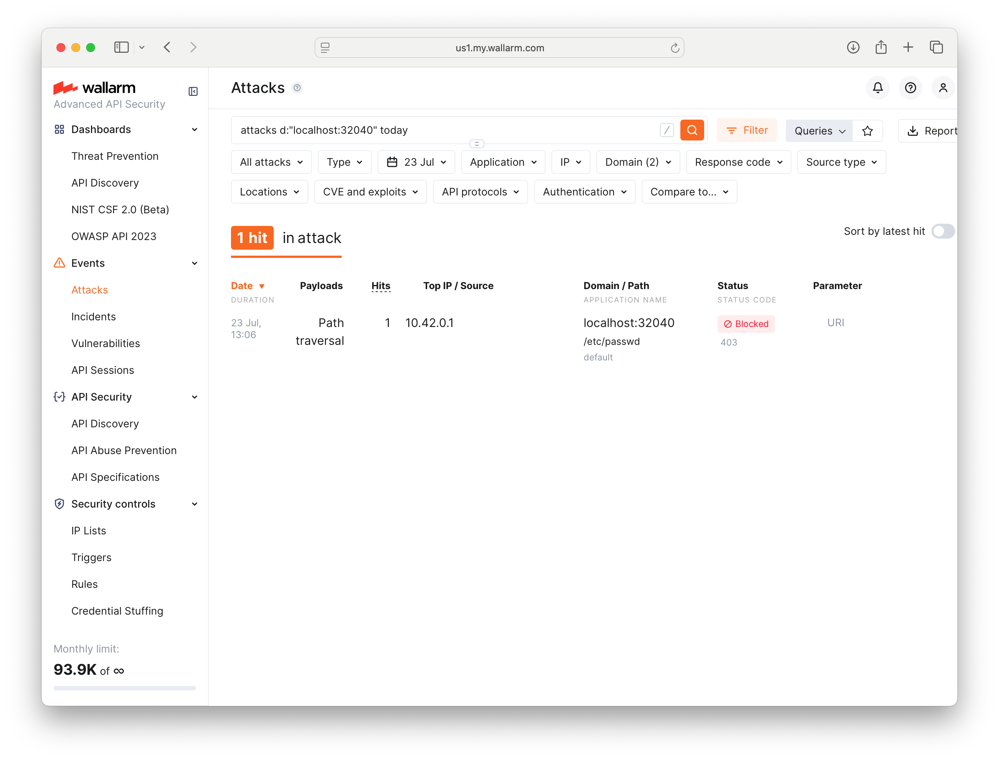

# Tim's SE Challenge

## Summary

I chose to deploy a sidecar because it seems like the quickest way to demonstrate Wallarm to Kubernetes users since it doesn't require any changes to the exisisting cluster networking setup. I set up a k3s cluster with a Traefik ingress controller. The cluster serves two applications, one with a Wallarm Sidecar, one without.  The layout is:


## Troubleshooting

The only issues I encountered were self-inflicted:  
* Initially deployed on a k3s VM running on my ARM Macbook. I had an issue with the postanalytics pod failing to start the wstore container. I tried to specify the node architecture in values.yaml with no result. Even with this error the WAF seemed to work, but I moved my work to an x86 cluster out of caution.  
* Forwarded a port from the host to the NGINX container, but the WAF was not detected by gotestwaf. Once I changed gotestwaf to point to the service port it started to work.
* Initially I installed gotestwaf on an x86 box running Debian 12 (golang 1.19) and got the error "unknown directive: toolchain". I found online that this directive was introduced in golang 1.21. Rather than tweak my stable box, I simply moved to a box with more up-to-date packages.

## Deployment Instructions

For complete a complete overview refer to the [Wallarm Documention](https://docs.wallarm.com/installation/kubernetes/sidecar-proxy/deployment/). To deploy a Wallarm Sidecar quickly follow these steps:

### Create an access token 
Open [Wallarm Dashboard -> Settings -> API tokens](https://us1.my.wallarm.com/settings/api-tokens). Click **"+ Create token"** and select **"Node deployment"** from the **"Token usage"** drop down and click **"Create"**. Save the value of the token for use later: 


### Install Wallarm Sidecar using Helm
1. Add and update the Wallarm Helm repo:
```
helm repo add wallarm https://charts.wallarm.com
helm repo update wallarm
```
2. Create a values.yaml file to configure your Wallarm deployment. Paste your API token into the value for "token:":
```
config:
  wallarm:
    api:
      token: "paste-your-token-here" 
      host: "us1.api.wallarm.com"
```
3. Create a namespace for the Sidecar, install using Wallarm's helm chart and the values.yaml file you just created:
```
helm install --version 6.3.0  challengev001 wallarm/wallarm-sidecar --wait -n wallarm-sidecar --create-namespace -f values.yaml
```
4. Verify the Wallarm pods are running:
```
kubectl -n wallarm-sidecar get pods
```
```
NAME                                                           READY   STATUS    RESTARTS   AGE
challengev001-wallarm-sidecar-controller-7b66b95cb6-n4hps      1/1     Running   0          26h
challengev001-wallarm-sidecar-postanalytics-77bdf84fcf-nkfmj   3/3     Running   0          26h
```

### Modify your application to enable Wallarm filtering
1. Edit your application's deployment to inject a Wallarm Sidecar. In this example the application is called nginx and is in a namespace called app1:
```
kubectl -n app1 edit deployment nginx
```
To enable Wallarm in the deployment add the following to the deployment's spec -> template -> metatdata -> labels:
```
        app: nginx
        wallarm-sidecar: enabled
```

Your deployment spec should resemble the following:
```
spec:
  progressDeadlineSeconds: 600
  replicas: 1
  revisionHistoryLimit: 10
  selector:
    matchLabels:
      app.kubernetes.io/instance: nginx
      app.kubernetes.io/name: nginx
  strategy:
    rollingUpdate:
      maxSurge: 25%
      maxUnavailable: 25%
    type: RollingUpdate
  template:
    metadata:
      creationTimestamp: null
      labels:
        app: nginx
        wallarm-sidecar: enabled
        app.kubernetes.io/instance: nginx
        app.kubernetes.io/managed-by: Helm
        app.kubernetes.io/name: nginx
        app.kubernetes.io/version: 1.29.0
        helm.sh/chart: nginx-21.0.8
```
2. Save and exit the file, if your edits are valid a new pod with an additional container will spin up. This additional container is the Wallarm Sidecar:
```
kubectl -n app1 get pods
```
```
NAME                    READY   STATUS    RESTARTS   AGE
nginx-87b7c5489-knd8b   0/2     Running   0          8s
nginx-c74f4ccd9-lxvfx   1/1     Running   0          4m41s
```
Once the new pod is ready, the old pod is removed:
```
kubectl -n app1 get pods
```
```
NAME                    READY   STATUS    RESTARTS   AGE
nginx-87b7c5489-knd8b   2/2     Running   0          2m29s
```
3. Optional, check the wallarm-sidecar-controller's logs to verify 
```
kubectl get pods -n wallarm-sidecar
```
```
NAME                                                           READY   STATUS    RESTARTS   AGE
challengev001-wallarm-sidecar-controller-7b66b95cb6-n4hps      1/1     Running   0          26h
challengev001-wallarm-sidecar-postanalytics-77bdf84fcf-nkfmj   3/3     Running   0          26h
```
```
kubectl -n wallarm-sidecar logs challengev001-wallarm-sidecar-controller-7b66b95cb6-n4hps
```
```
INFO[83937] action=mutationreview kind="/v1, Kind=Pod" namespace=app1 operation=CREATE pod= uid=855e964f-ed6c-432a-9410-6b6514a0daca userinfo="{system:serviceaccount:kube-system:replicaset-controller eca1943f-c2d5-4afc-aa52-c69553f1010c [system:serviceaccounts system:serviceaccounts:kube-system system:authenticated] map[authentication.kubernetes.io/credential-id:[JTI=7f4ff047-c1d7-4efc-862f-dd106fea883e]]}"
```


### Enable blocking (optional)
Wallarm's default [filtration mode](https://docs.wallarm.com/admin-en/configure-wallarm-mode/) is "monitoring", to enable blocking:
1. Edit your application's deployment:
```
kubectl -n app1 edit deployment nginx
```
2. Set Wallarm's mode to blocking add the following annotation to the deployment's spec -> template -> metatdata -> :
```
      annotations:
        sidecar.wallarm.io/wallarm-mode: block
```
Your deployment spec should resemble the following:
```
spec:
  progressDeadlineSeconds: 600
  replicas: 1
  revisionHistoryLimit: 10
  selector:
    matchLabels:
      app.kubernetes.io/instance: nginx
      app.kubernetes.io/name: nginx
  strategy:
    rollingUpdate:
      maxSurge: 25%
      maxUnavailable: 25%
    type: RollingUpdate
  template:
    metadata:
      annotations:
        sidecar.wallarm.io/wallarm-mode: block
      creationTimestamp: null
      labels:
        app: nginx
        wallarm-sidecar: enabled
        app.kubernetes.io/instance: nginx
        app.kubernetes.io/managed-by: Helm
        app.kubernetes.io/name: nginx
        app.kubernetes.io/version: 1.29.0
        helm.sh/chart: nginx-21.0.8
```
3. Save your edits and wait for the newly configured pod to spin up.
4. If blocking is enabled correctly, the following should return an http 403 error.  If blocking is not active, it will return an http 404 error. Alter the URL to have the correct hostname or IP:PORT port for your service:
```
curl localhost:32040/etc/passwd
<html>
<head><title>403 Forbidden</title></head>
<body>
<center><h1>403 Forbidden</h1></center>
<hr><center>nginx/1.28.0</center>
</body>
</html>
```
5. Check the [Attacks section of the Wallarm Dashboard](https://us1.my.wallarm.com/attacks?q=attacks%20today&mode=only-true) to see the attack as registered and blocked:


